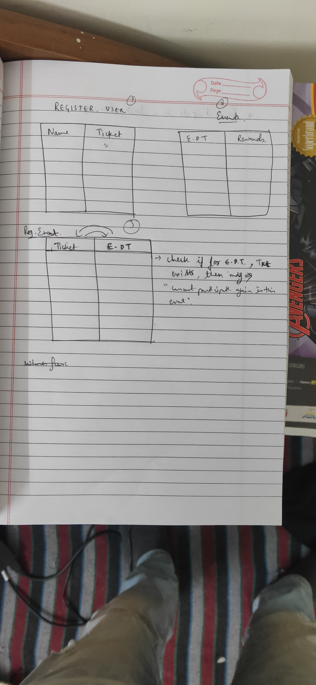
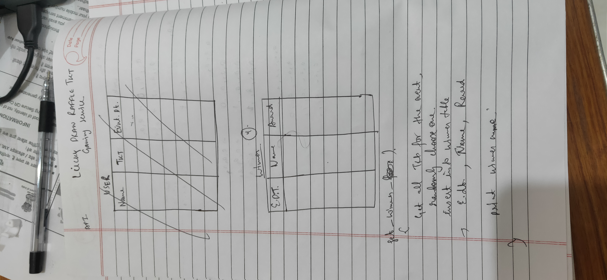

# Raffler_gaming
CREATE TABLE Events(
id INTEGER PRIMARY KEY,
Event_date TEXT,
Rewards TEXT)

* Create a txt file with the information about event date and award for that event.
* Read from the txt file into an EVENTS Table.
build event database by
